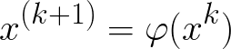
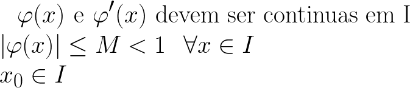

# Tarefa II

Tarefa solicitada no curso de Métodos Numéricos II, pelo professor @thadeupenna

## Método do Ponto Fixo

Este método consiste em encontrar raízes de equações, transformando a equação em uma composição de funções, gerando desta forma uma sequência de aproximações para a raiz da equação.

O método possui a seguinte relação para a sequência de aproximações:

Precisamos assim de três condições para a utilização deste método:

Após isto, será possível que consiga-se descobrir o valor da raiz de qualque função que satisfaça as condições dadas.

## Aplicação do método.

Utilizando a função cos(x)-x, aplicamos o método em linguagem C para gerar o número de interações e as raizes geradas pelo método. Após os cálculos feitos pelo computador, chegamos aos seguintes pontos:

